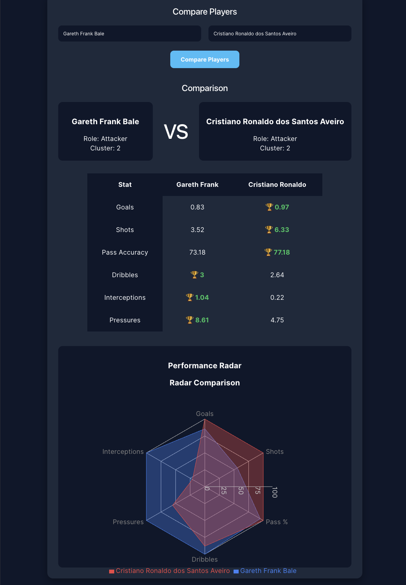
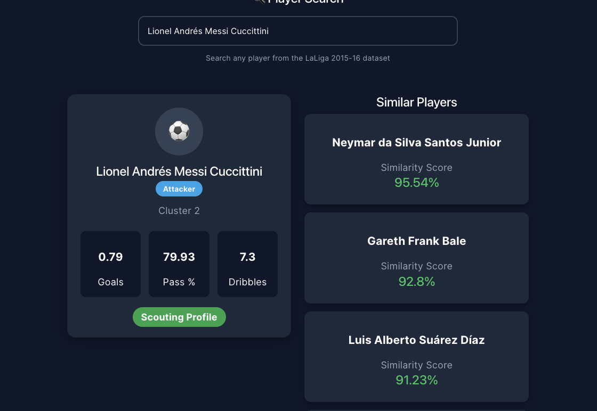

# ⚽ Football Performance Analysis

An end-to-end football analytics platform for player profiling, role discovery, player similarity, and player recommendation using StatsBomb event data.

The project combines data ingestion, feature engineering, unsupervised clustering, supervised role classification, similarity analysis, a FastAPI backend, and an interactive React dashboard.

---

## 🖥️ Application

### Player Comparison

Compare two players across key performance metrics, roles, clusters, and a radar-based performance profile.



### Player Search & Similarity

Search the player database and retrieve statistically similar players using the similarity engine.



---

## 🚀 Features

- ⚽ Player performance profiling
- 🔎 Player search
- 📊 Player statistics
- 🧩 K-Means player clustering
- 🏷️ Player role / archetype discovery
- 🤖 SVM-based role classification
- 🔗 Player similarity using cosine similarity
- 👥 Similar-player recommendations
- ⚖️ Player comparison
- 📈 Interactive visualizations
- ⚡ FastAPI REST API
- ⚛️ React + Vite frontend

---

## 🧠 Machine Learning Pipeline

```text
StatsBomb Open Data
        │
        ▼
Data Ingestion
        │
        ▼
Season / Match Dataset
        │
        ▼
Player Profile Construction
        │
        ▼
Feature Engineering
        │
        ▼
Standardization
        │
        ▼
K-Means Clustering
        │
        ▼
5 Player Clusters
        │
        ▼
Role Mapping
        │
        ├── Defender
        ├── Midfielder
        ├── Attacker
        ├── Goalkeeper
        └── Utility
        │
        ├────────────────────┐
        ▼                    ▼
SVM Role Classifier    Similarity Engine
                           │
                           ▼
                    Player Recommendations
                           │
                           ▼
                     FastAPI Backend
                           │
                           ▼
                     React Dashboard


